  

<h1 align="center">Hi, I'm Ahmed* 👋</h1>

  <strong>Undergraduate Computer Science Student | Front-End Developer</strong>

  <em>I'm passionate about coding, problem-solving, and creating modern web experiences with clean and efficient code.</em>

---

### 🌐 Connect With Me

---

### 💻 Tech Stack

#### **Frontend & Design**

#### **Backend & Databases**

#### **Languages**

#### **Tools & Environment**

---

### 📊 GitHub Analytics

  
  

  

---

### 🎯 Hobbies & Interests

*   🧠 **Problem-Solving & Algorithms**
*   🎮 **Gaming**
*   ♟️ **Chess**

---

  

